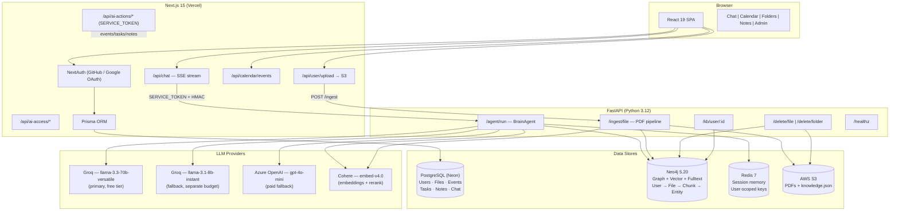
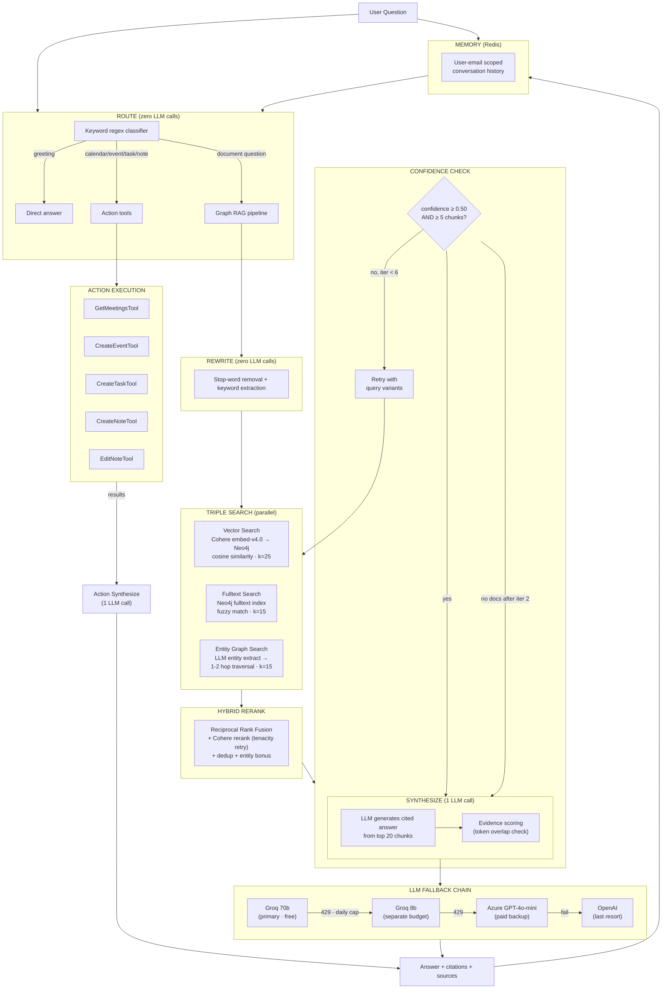

# IntelliDoc — Architecture

## 1. Application Architecture

```mermaid
graph TB
    subgraph Browser["Browser"]
        UI["React 19 SPA"]
        Pages["Chat | Calendar | Folders | Notes | Admin"]
    end

    subgraph NextJS["Next.js 15 &lpar;Vercel&rpar;"]
        Auth["NextAuth &lpar;GitHub / Google OAuth&rpar;"]
        API_Chat["/api/chat — SSE stream"]
        API_Cal["/api/calendar/events"]
        API_Upload["/api/user/upload → S3"]
        API_AI["/api/ai-actions/* &lpar;SERVICE_TOKEN&rpar;"]
        API_Access["/api/ai-access/*"]
        Prisma["Prisma ORM"]
    end

    subgraph FastAPI["FastAPI &lpar;Python 3.12&rpar;"]
        Agent["/agent/run — BrainAgent"]
        Ingest["/ingest/file — PDF pipeline"]
        Delete["/delete/file | /delete/folder"]
        KB["/kb/user/:id"]
        Health["/healthz"]
    end

    subgraph Storage["Data Stores"]
        Postgres[("PostgreSQL &lpar;Neon&rpar;<br/>Users · Files · Events<br/>Tasks · Notes · Chat")]
        Neo4j[("Neo4j 5.20<br/>Graph + Vector + Fulltext<br/>User → File → Chunk → Entity")]
        Redis[("Redis 7<br/>Session memory<br/>User-scoped keys")]
        S3[("AWS S3<br/>PDFs + knowledge.json")]
    end

    subgraph LLM["LLM Providers"]
        Groq["Groq — llama-3.3-70b-versatile<br/>&lpar;primary, free tier&rpar;"]
        GroqFB["Groq — llama-3.1-8b-instant<br/>&lpar;fallback, separate budget&rpar;"]
        Azure["Azure OpenAI — gpt-4o-mini<br/>&lpar;paid fallback&rpar;"]
        Cohere["Cohere — embed-v4.0<br/>&lpar;embeddings + rerank&rpar;"]
    end

    UI --> Auth
    UI --> API_Chat & API_Cal & API_Upload
    Auth --> Prisma
    API_Chat -->|SERVICE_TOKEN + HMAC| Agent
    API_Upload -->|POST /ingest| Ingest
    API_AI -->|AI creates events/tasks/notes| NextJS
    Prisma --> Postgres
    Agent --> Neo4j & Redis
    Agent --> Groq & GroqFB & Azure
    Agent --> Cohere
    Ingest --> S3
    Ingest --> Neo4j
    Ingest --> Cohere
    Delete --> Neo4j & S3
    KB --> Neo4j
```

---

## 2. AI / RAG Pipeline Architecture

```mermaid
flowchart TB
    Q["User Question"] --> Route

    subgraph Route["ROUTE &lpar;zero LLM calls&rpar;"]
        KW["Keyword regex classifier"]
        KW -->|greeting| Direct["Direct answer"]
        KW -->|calendar/event/task/note| Actions["Action tools"]
        KW -->|document question| RAG["Graph RAG pipeline"]
    end

    subgraph Rewrite["REWRITE &lpar;zero LLM calls&rpar;"]
        Stop["Stop-word removal + keyword extraction"]
    end

    RAG --> Rewrite
    Rewrite --> Search

    subgraph Search["TRIPLE SEARCH &lpar;parallel&rpar;"]
        direction LR
        VS["Vector Search<br/>Cohere embed-v4.0 → Neo4j<br/>cosine similarity · k=25"]
        FT["Fulltext Search<br/>Neo4j fulltext index<br/>fuzzy match · k=15"]
        EG["Entity Graph Search<br/>LLM entity extract →<br/>1-2 hop traversal · k=15"]
    end

    Search --> Rerank

    subgraph Rerank["HYBRID RERANK"]
        RRF["Reciprocal Rank Fusion<br/>+ Cohere rerank &lpar;tenacity retry&rpar;<br/>+ dedup + entity bonus"]
    end

    Rerank --> Confidence

    subgraph Confidence["CONFIDENCE CHECK"]
        CC{"confidence ≥ 0.50<br/>AND ≥ 5 chunks?"}
        CC -->|yes| Synth
        CC -->|no docs after iter 2| Synth
        CC -->|no, iter < 6| Retry["Retry with<br/>query variants"]
    end

    Retry --> Search

    subgraph Synth["SYNTHESIZE &lpar;1 LLM call&rpar;"]
        LLM["LLM generates cited answer<br/>from top 20 chunks"]
        Evid["Evidence scoring<br/>&lpar;token overlap check&rpar;"]
        LLM --> Evid
    end

    subgraph Fallback["LLM FALLBACK CHAIN"]
        direction LR
        G1["Groq 70b<br/>&lpar;primary · free&rpar;"]
        G2["Groq 8b<br/>&lpar;separate budget&rpar;"]
        AZ["Azure GPT-4o-mini<br/>&lpar;paid backup&rpar;"]
        OA["OpenAI<br/>&lpar;last resort&rpar;"]
        G1 -->|429 · daily cap| G2
        G2 -->|429| AZ
        AZ -->|fail| OA
    end

    Synth --> Fallback
    Fallback --> Ans["Answer + citations + sources"]

    subgraph ActionFlow["ACTION EXECUTION"]
        direction LR
        GM["GetMeetingsTool"]
        CE["CreateEventTool"]
        CT["CreateTaskTool"]
        CN["CreateNoteTool"]
        EN["EditNoteTool"]
    end

    Actions --> ActionFlow
    ActionFlow -->|results| ActSynth["Action Synthesize<br/>&lpar;1 LLM call&rpar;"]
    ActSynth --> Ans

    subgraph Memory["MEMORY &lpar;Redis&rpar;"]
        MEM["User-email scoped<br/>conversation history"]
    end

    Q --> Memory
    Memory --> Route
    Ans --> Memory
```
