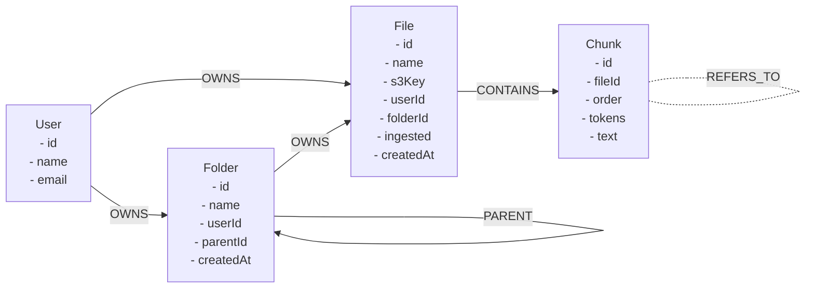
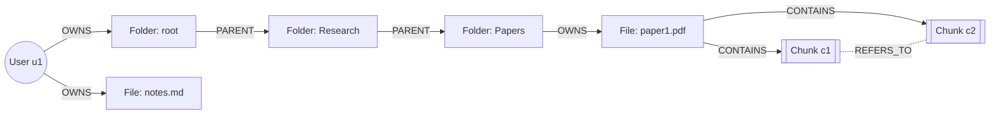
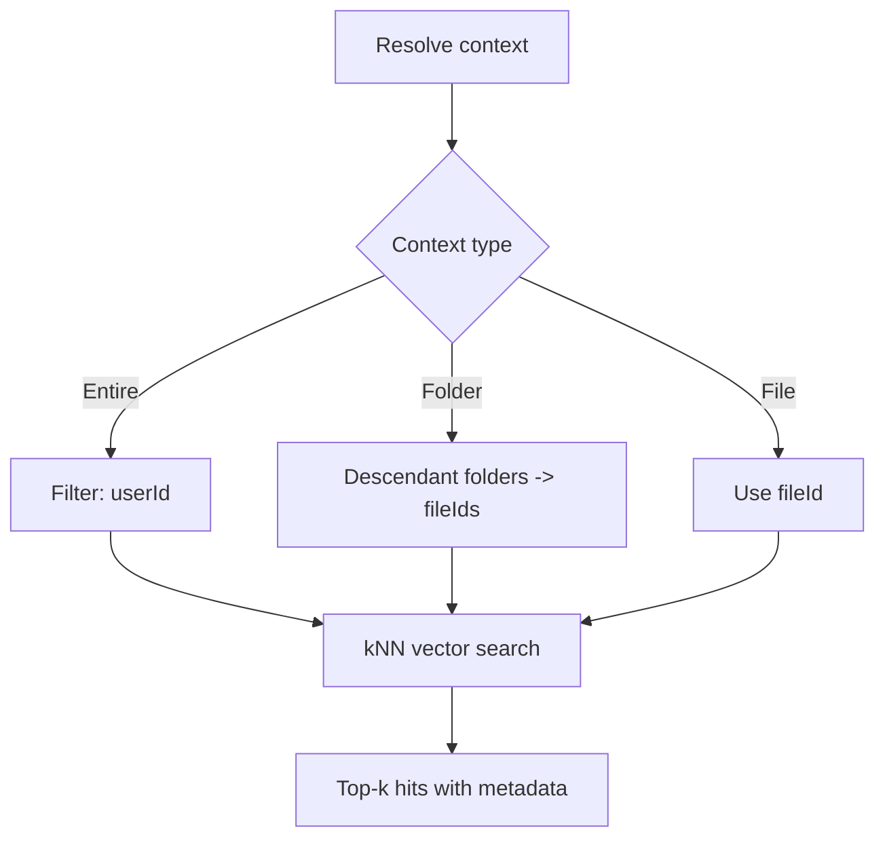

# Context-Aware Chat – Architecture and Workflow (FastAPI + Next.js)

Overview
This document explains a production-style setup to power context-aware chat across user files using:
- Next.js (App Router) as the web app
- Python FastAPI service for AI orchestration
- Prisma (SQLite dev now; replace with Postgres in prod) as system of record
- Storage: AWS S3 for blobs
- Knowledge: Neo4j (graph) + vector index (FAISS local, or Neo4j vector if preferred)

Guiding principles
- Separation of concerns: Next.js handles auth/UI; FastAPI handles AI pipelines and chat
- Idempotent ingestion: derive knowledge state from Prisma + S3
- User isolation: namespace data per user (graph labels/properties + vector index stores)
- Eventual consistency: background ingestion updates after uploads/changes

1) Data model (source of truth)
- Prisma tables (already in repo): User, Folder, File
- S3 keys: GRAPH-RAG/{userId}/{optional-folderId}/{filename}
- Ownership: file.userId and folder.userId enforced in API routes

2) Knowledge model
- Graph (Neo4j)
  - (:User {id})
    -[:OWNS]->(:Folder {id, name}) hierarchical edges [:PARENT]->(:Folder)
    -[:OWNS]->(:File {id, name, s3Key})
  - (:File)-[:CONTAINS]->(:Chunk {id, text, order, tokens})
  - Optional cross-links: (:Chunk)-[:REFERS_TO]->(:Chunk) via entity/keyword linking
- Vectors (FAISS or Neo4j vector)
  - per user collection; store (chunkId, vector, fileId, folderId)

3) Ingestion pipeline
- Trigger: after file upload (Next API /api/user/upload) enqueue a job (future)
- Pull file from S3 via s3Key
- Extract text (pdf/txt/docx parsers)
- Chunk text (token budget)
- Embed chunks (OpenAI or local model)
- Upsert:
  - Graph: ensure User, Folder, File nodes; attach Chunk nodes and edges
  - Vector index: add chunk vectors with metadata
- Mark file ingested and store stats in Prisma (optional columns)

4) Chat flow
- Next.js /chat page collects messages + context selection
- Next.js calls FastAPI /chat with { messages, context, userId }
- FastAPI resolves context:
  - entire: search across user’s vectors
  - folder: filter by folderId (and descendants)
  - file: filter by fileId
- Retrieve top-k chunks
- Build prompt with chat history + context snippets
- Call LLM, stream back response (upgrade to SSE later)
- Include citations (fileId, fileName, snippet offsets)

5) Services inside FastAPI
- storage: S3 client (read)
- prisma access: via REST from Next.js or via read-only DB connection exposed to ai (preferred: REST gateway endpoints in Next.js to avoid direct DB coupling)
- graph: Neo4j driver session utils
- vectors: FAISS index per user (persisted locally under ai/.data)
- llm: OpenAI or compatible provider

6) Environment & configuration
- NEXT: uses existing .env for GitHub OAuth, AWS, DB
- AI (FastAPI): separate .env
  - AWS credentials/region/bucket (read only)
  - NEO4J_URI, NEO4J_USER, NEO4J_PASSWORD
  - OPENAI_API_KEY (or provider)
  - DATA_DIR for FAISS persistence
  - NEXT_API_BASE (to call Next endpoints if needed)

7) APIs
- FastAPI
  - POST /chat { userId, messages, context }
  - POST /ingest/file { userId, fileId }
  - POST /ingest/folder { userId, folderId } (recursive)
  - POST /ingest/all { userId }
- Next.js
  - Existing /api/user/files-folders (used by chat page)
  - Optional: /api/ai/proxy/* to forward auth info to FastAPI if needed

8) Deployment
- Next.js deployed to Vercel or similar
- FastAPI deployed separately (Fly.io/Render/AWS ECS)
- Neo4j Aura (managed) or self-hosted
- S3 stays as is
- Secure cross-service comm via service token or VPC networking

9) Local development
- Run Neo4j locally via Docker
- Run FastAPI locally via uvicorn
- Point Next.js to local FastAPI URL for /api/chat proxy (or call directly)
- Seed with sample files

10) Observability
- Structured logs (requestId/userId)
- Metrics: ingestion time, chunk count, vector count, chat latency
- Traces: chat request spans (frontend->fastapi->llm)

11) Security
- All chat/ingest endpoints require a userId from a trusted caller (Next) validated with a shared secret
- Per-user namespace in graph and vector index
- No direct client to AI service calls without auth

12) Migration plan
- Phase 1 (now): stub /chat backend (echo), page/selector built
- Phase 2: add ingest APIs and local Neo4j+FAISS wiring
- Phase 3: switch chat to use retrieval and citations

Directory skeleton (no code yet)
```
ai/
  app/
    __init__.py
    main.py            # FastAPI bootstrap (to be added)
    routers/
      __init__.py
      chat.py          # /chat endpoint (to be added)
      ingest.py        # ingestion endpoints (to be added)
    services/
      __init__.py
      storage.py       # S3 read utils (to be added)
      graph.py         # Neo4j helpers (to be added)
      vectors.py       # FAISS helpers (to be added)
      llm.py           # LLM caller (to be added)
    models/
      __init__.py
      schemas.py       # Pydantic models (to be added)
  tests/
    test_chat.py       # (to be added)
  docs/
    ARCHITECTURE.md    # this file
  scripts/
    dev.sh             # run uvicorn, etc. (to be added)
  README.md
```

How to wire Next.js -> FastAPI
- Option A (simple): change Next /api/chat to forward to FastAPI URL (server-to-server). Keep current echo as fallback for local dev.
- Option B (direct): ChatClient calls FastAPI URL; include a service token header from Next config injected via an internal proxy.

Next steps
- Confirm this plan, then I’ll:
  1) Add empty Python files per skeleton
  2) Replace Next /api/chat echo to proxy requests to FastAPI
  3) Provide Docker compose for Neo4j + FastAPI for local dev

## Diagrams: End-to-End Workflow and Graph Model

### A) End-to-end workflow (Upload → Ingest → Chat)
```mermaid
flowchart TD
    U[User] -->|Upload file| NHome[Next.js /home UI]
    NHome --> API_UPLOAD[/POST /api/user/upload/]
    API_UPLOAD -->|PutObject| S3[(S3)]
    API_UPLOAD -->|create File row| DB[(Prisma DB)]
    API_UPLOAD --> JOB[[Enqueue ingest job (future)]]

    subgraph FastAPI Service
      INJ[/POST /ingest/file|folder|all/]
      DL[Pull blob from S3]
      XT[Extract text (pdf/txt/docx)]
      CK[Chunk text (token budget)]
      EM[Embed chunks]
      G[Upsert graph (Neo4j)]
      V[Upsert vectors (FAISS)]
    end

    JOB -.->|triggers| INJ
    INJ --> DL --> XT --> CK --> EM --> G
    EM --> V

    %% Chat flow
    U --> NChat[Next.js /chat UI]
    NChat --> API_CHAT[/POST /api/chat (proxy)/]
    API_CHAT --> F_CHAT[/FastAPI /chat/]
    F_CHAT --> RET[Vector search (top-k)]
    RET --> F_FILTER[Filter by Entire/Folder/File]
    F_FILTER --> CTX[Assemble snippets + history]
    CTX --> LLM[LLM call]
    LLM --> RESP[Assistant + citations]
    RESP --> NChat
```

Step-by-step
- Upload: UI sends file to Next; Next stores in S3 and persists File row in Prisma.
- Ingest trigger: enqueue a job (future) or manual POST to FastAPI /ingest/*.
- Ingest pipeline: download blob, extract, chunk, embed; upsert Neo4j nodes/edges and add vectors to per-user FAISS.
- Chat: UI posts messages + context to Next /api/chat; Next proxies to FastAPI /chat with service auth.
- Retrieval: FastAPI queries vectors with filters (entire/folder/file), optionally expands via graph; builds prompt; calls LLM; returns response with citations.

### B) Chat request flow (flowchart)
```mermaid
flowchart TD
  U[User] --> UI[Next.js /chat UI]
  UI --> API[/Next /api/chat (server)/]
  API --> AI[/FastAPI /chat/]
  AI -->|validate token + userId| AUTH{Authorized?}
  AUTH -- No --> ERR[(401/403)]
  AUTH -- Yes --> CTX{Context}
  CTX -->|Entire| Q1[Query vectors by userId]
  CTX -->|Folder| Q2[Collect descendant fileIds via graph; filter vectors]
  CTX -->|File| Q3[Filter vectors by fileId]
  Q1 --> TOPK[Vector search (top-k)]
  Q2 --> TOPK
  Q3 --> TOPK
  TOPK --> EXP{Graph expand?}
  EXP -- Yes --> GX[Fetch related nodes/snippets]
  GX --> PROMPT[Assemble prompt: history + snippets]
  EXP -- No --> PROMPT
  PROMPT --> LLM[LLM call]
  LLM --> RESP[Response + citations]
  RESP --> API
  API --> UI
  UI --> U
```

### C) Graph data model (flowchart)


### D) Example: nested folders and files (flowchart)


### E) Folder/file filtering and traversal
- Entire workspace: vector filter { userId }.
- Folder context: include descendants via variable-length traversal, then filter vectors by fileId in that set.
- File context: vector filter { userId, fileId }.

Flowchart for retrieval filters


Example Cypher to collect all fileIds under a folder
```cypher
MATCH (root:Folder {id:$folderId})-[:PARENT*0..]->(f:Folder)
OPTIONAL MATCH (f)-[:OWNS]->(file:File)
RETURN collect(distinct file.id) AS fileIds
```

FAISS metadata per vector entry
- chunkId, fileId, folderId, userId
- path: array of ancestor folderIds
- fileName, folderName, offsets, tokenCount

### F) Neo4j constraints (idempotent upserts)
```cypher
CREATE CONSTRAINT user_id IF NOT EXISTS FOR (n:User) REQUIRE n.id IS UNIQUE;
CREATE CONSTRAINT folder_id IF NOT EXISTS FOR (n:Folder) REQUIRE n.id IS UNIQUE;
CREATE CONSTRAINT file_id IF NOT EXISTS FOR (n:File) REQUIRE n.id IS UNIQUE;
CREATE CONSTRAINT chunk_id IF NOT EXISTS FOR (n:Chunk) REQUIRE n.id IS UNIQUE;
```
